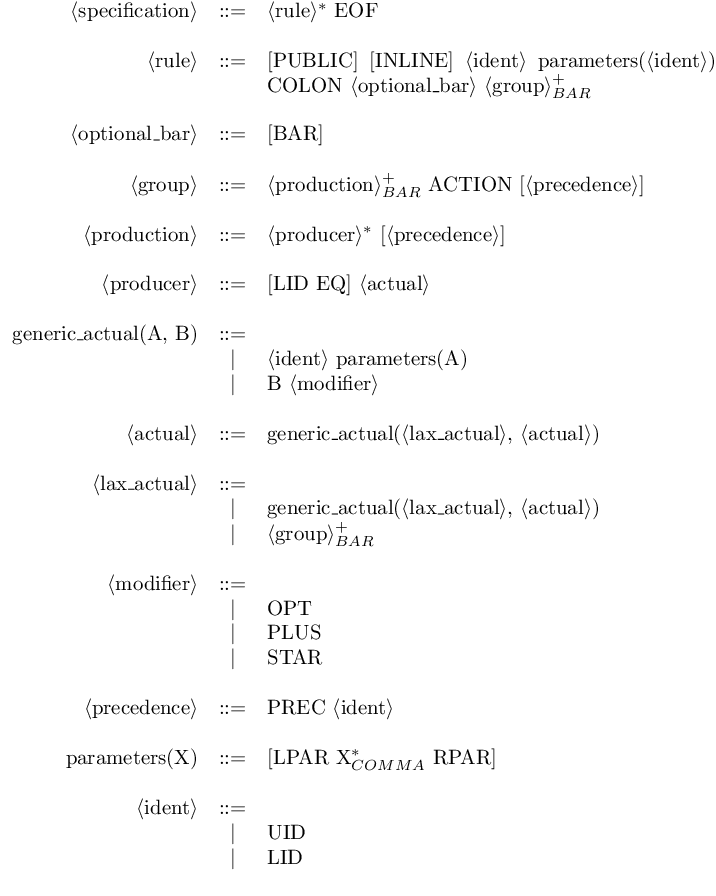
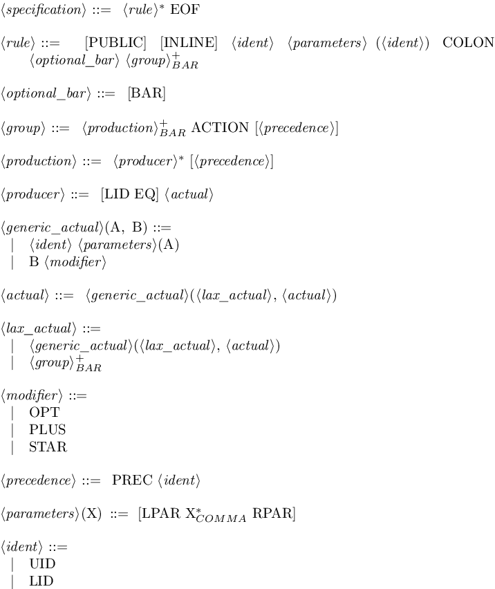
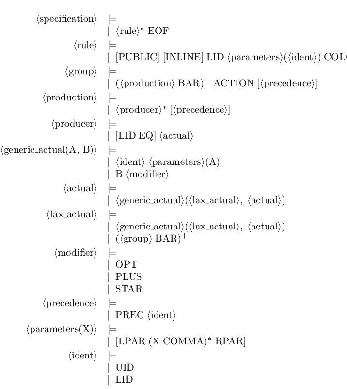
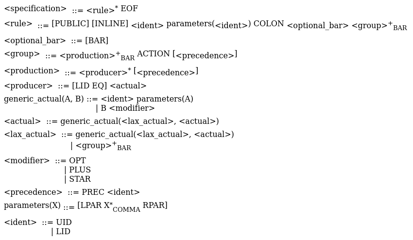

# Obelisk
## Overview
**Obelisk** is a simple tool which produces pretty-printed output from a [Menhir] parser file (*.mly*).

It is inspired from [yacc2latex] and is also written in [OCaml], but is aimed at supporting features from Menhir instead of only those of ocamlyacc.

## Installation
### Dependencies
- OCaml 4.04.1
- OCamlbuild 0.11.0
- Menhir 20170418

The Makefile also uses [imagemagick] and [wkhtmltopdf] to build documentation images.

If you use [OPAM], just type :
```
opam install ocamlbuild menhir
```

### Manual build
Since [Roman] is a git submodule, you should `git clone --recursive` to clone the **Obelisk** repository or `git submodule update --init` after a simple clone.

Then just type :
```
make
```

This will provide you with a **obelisk** executable which you can feed *.mly* files with.

## Usage
```
obelisk [latex|html] [options] <file>
```

By default **Obelisk** defaults to standard output, use `-o <file>` to specify an output file.

### Pattern recognition
**Obelisk** can infer some common patterns (possibly parameterized):
- options
- lists and non-empty lists
- separated lists and non-empty separated lists

Once recognized, if the `-i` switch is specified the rules are deleted and their instances are replaced with default constructions (eg. *\_\**, *\_+*, *[\_]*). Without the `-i` flag, only the productions of the recognized rules are replaced, the total amount of rules remaining the same.

For example, on these simple rules (from this [file](doc/reco.mly)):
```
my_option(X, Y):
  |     {}
  | Y X {}

my_list(A):
  |              {}
  | A my_list(A) {}

my_nonempty_list(C):
  | C                     {}
  | C my_nonempty_list(C) {}

my_separated_nonempty_list(X,Y):
  | X                                   {}
  | X Y my_separated_nonempty_list(X,Y) {}

my_separated_list(X,S):
  |                                 {}
  | my_separated_nonempty_list(X,S) {}

my_rule(E,F,S1,S2):
  | my_option(E, F)                    {}
  | my_list(E)                         {}
  | my_nonempty_list(F)                {}
  | my_separated_nonempty_list(E,S1)   {}
  | my_separated_list(F,S2)            {}
```
**Obelisk** outputs:
```
my_option(X, Y) ::= [Y X]

my_list(A) ::= A*

my_nonempty_list(C) ::= C+

my_separated_nonempty_list(X, Y) ::= X (Y X)*

my_separated_list(X, S) ::= [X (S X)*]

my_rule(E, F, S1, S2) ::= my_option(E, F)
                        | my_list(E)
                        | my_nonempty_list(F)
                        | my_separated_nonempty_list(E, S1)
                        | my_separated_list(F, S2)
```
And with the `-i` switch:
```
my_rule(E, F, S1, S2) ::= [F E]
                        | E*
                        | F+
                        | E (S1 E)*
                        | [F (S2 F)*]
```

### Multi-format output
By default the output format is a simple text format close to the BNF syntax. You can use the subcommands `latex` or `html` to get a LaTeX (resp. HTML) file.

Use the following options to tweak the LaTeX:
- `-tabular`: a *tabular*-based format from the [tabu] package (default)
- `-syntax`: use the [syntax] package
- `-backnaur`: use the [backnaur] package (not recommended: manual line-wrapping through this [trick](https://tex.stackexchange.com/a/308753))

In either cases, the output may be customized *via* the use of LaTeX commands that you can redefine to fit your needs. The commands names are auto-generated from the terminal names, and because of LaTeX limitations, underscore are removed and numbers are converted into their roman form (thanks to the [Roman] module).

The HTML file uses internal CSS stylesheet which allows one to customize the output (in a poorer way than with the `latex` switch).

### Example
Here are the different formats output obtained by **Obelisk** from its own [parser](src/parser.mly).

#### Default
```
<specification> ::= <rule>* EOF

<rule> ::= [PUBLIC] [INLINE] <ident> parameters(<ident>) COLON <optional_bar> <group> (BAR <group>)*

<optional_bar> ::= [BAR]

<group> ::= <production> (BAR <production>)* ACTION [<precedence>]

<production> ::= <producer>* [<precedence>]

<producer> ::= [LID EQ] <actual>

generic_actual(A, B) ::= <ident> parameters(A)
                       | B <modifier>

<actual> ::= generic_actual(<lax_actual>, <actual>)

<lax_actual> ::= generic_actual(<lax_actual>, <actual>)
               | <group> (BAR <group>)*

<modifier> ::= OPT
             | PLUS
             | STAR

<precedence> ::= PREC <ident>

parameters(X) ::= [LPAR [X (COMMA X)*] RPAR]

<ident> ::= UID
          | LID
```

#### LaTeX
##### Tabular


##### Syntax


##### Backnaur


#### HTML


[Menhir]: http://gallium.inria.fr/~fpottier/menhir/
[yacc2latex]: http://www-verimag.imag.fr/~raymond/index.php/yacc2latex/
[OCaml]: http://ocaml.org/
[OPAM]: http://opam.ocaml.org/
[wkhtmltopdf]: https://wkhtmltopdf.org/
[imagemagick]: http://www.imagemagick.org/script/index.php
[tabu]: https://www.ctan.org/pkg/tabu
[syntax]: https://www.ctan.org/pkg/syntax-mdw
[backnaur]: https://www.ctan.org/pkg/backnaur
[Roman]: https://github.com/lindig/roman
