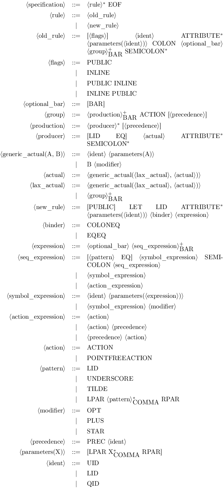
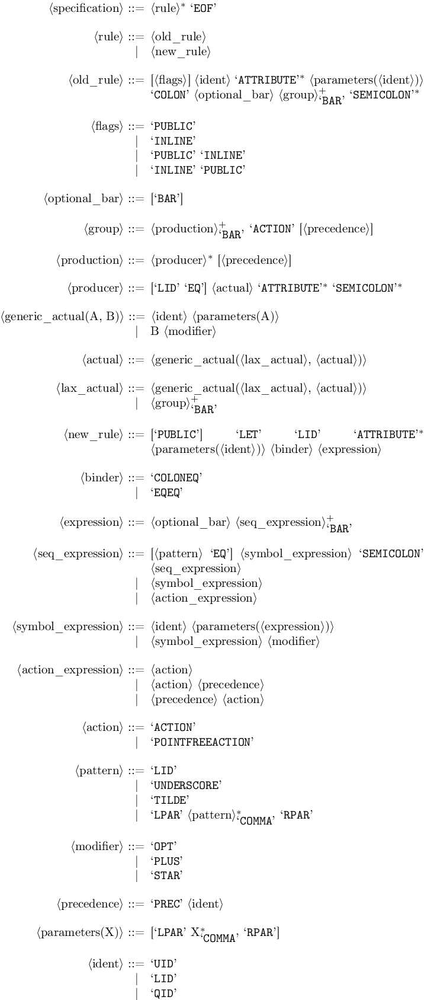
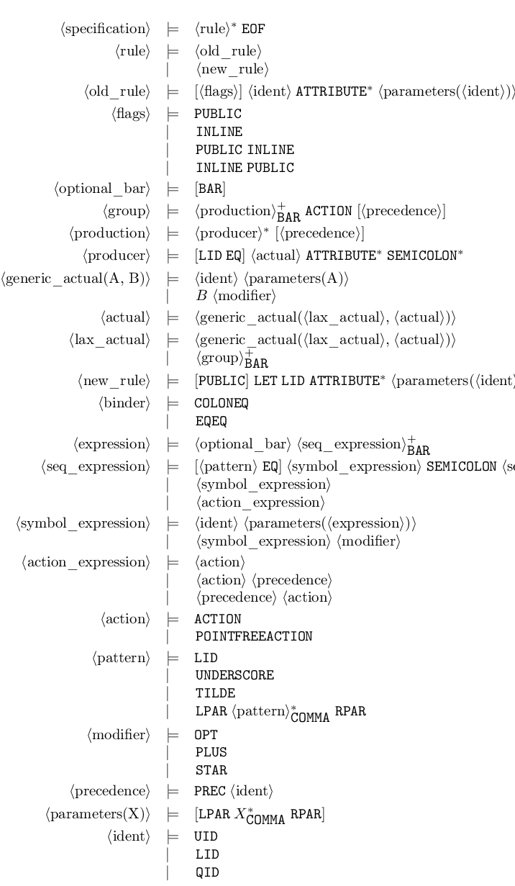

# Obelisk [](https://travis-ci.org/Lelio-Brun/Obelisk) [](https://github.com/rizo/awesome-ocaml)
**Obelisk** is a simple tool which produces pretty-printed output from a [Menhir] parser file (_.mly_).

It is inspired from [yacc2latex] and is also written in [OCaml], but is aimed at supporting features from Menhir instead of only those of [ocamlyacc].

## Table of Contents
* [Installation](#installation)
  + [Dependencies](#dependencies)
  + [OPAM](#opam)
  + [Manual installation](#manual-installation)
* [Usage](#usage)
  + [Pattern recognition](#pattern-recognition)
  + [Multi-format output](#multi-format-output)
    - [LaTeX](#latex)
    - [HTML](#html)
  + [Example](#example)
    - [Default](#default)
    - [LaTeX](#latex-1)
      * [Tabular](#tabular)
      * [Syntax](#syntax)
      * [Backnaur](#backnaur)
    - [HTML](#html-1)

## Installation
### Dependencies
- [OCaml] >= 4.08
- [Dune] >= 2.2.0
- [Menhir]
- [Re]

The Makefile also uses [imagemagick] and [wkhtmltopdf] to build documentation images.

In addition to the package [suffix], which is used to define starred commands, here is a summary of package dependencies for the different LaTeX modes: 

- `-tabular` :
  + [tabu]
  + [longtable] as a dependency of [tabu] to use the environment `longtabu` 
- `-syntax` : [syntax] from the bundle [mdwtools] 
- `-backnaur` : [backnaur]

### OPAM
If you use [OPAM], just type:
```
opam install obelisk
```

### Manual installation
Just `git clone` to clone the **Obelisk** repository, then type:
```
make
```

This will provide you with an executable which you can feed _.mly_ files with: `dune exec src/main.exe -- <options> <file.mly>`.

If you want to install obelisk, you can type:
```
dune install [--prefix <the destination directory>]
```

## Usage
```
obelisk [latex|html] [options] <files>
```

If multiple files are specified, **Obelisk** will output a concatenated result, without consistency checks, so the user is responsible for avoiding eg. name clashes between the several files.

By default **Obelisk** defaults to standard output, use `-o <file>` to specify an output file.

### Pattern recognition
**Obelisk** can infer some common patterns (possibly parameterized):
- options
- lists and non-empty lists
- separated lists and non-empty separated lists

Once recognized, if the `-i` switch is specified the rules are deleted and their instances are replaced with default constructions (eg. *\_\**, *\_+*, *[\_]*). Without the `-i` flag, only the productions of the recognized rules are replaced, the total amount of rules remaining the same.

For example, on these simple rules (from this [file](misc/reco.mly)):
```
my_option(X, Y):
  |     {}
  | Y X {}

my_list(A):
  |              {}
  | A my_list(A) {}

my_nonempty_list(C):
  | C                     {}
  | C my_nonempty_list(C) {}

my_separated_nonempty_list(X,Y):
  | X                                   {}
  | X Y my_separated_nonempty_list(X,Y) {}

my_separated_list(X,S):
  |                                 {}
  | my_separated_nonempty_list(X,S) {}

my_rule(E,F,S1,S2):
  | my_option(E, F)                    {}
  | my_list(E)                         {}
  | my_nonempty_list(F)                {}
  | my_separated_nonempty_list(E,S1)   {}
  | my_separated_list(F,S2)            {}
```
**Obelisk** outputs:
```
<my_option(X, Y)> ::= [Y X]

<my_list(A)> ::= A*

<my_nonempty_list(C)> ::= C+

<my_separated_nonempty_list(X, Y)> ::= X (Y X)*

<my_separated_list(X, S)> ::= [X (S X)*]

<my_rule(E, F, S1, S2)> ::= <my_option(E, F)>
                          | <my_list(E)>
                          | <my_nonempty_list(F)>
                          | <my_separated_nonempty_list(E, S1)>
                          | <my_separated_list(F, S2)>
```
And with the `-i` switch:
```
<my_rule(E, F, S1, S2)> ::= [F E]
                          | E*
                          | F+
                          | E (S1 E)*
                          | [F (S2 F)*]
```

### Multi-format output
By default the output format is a simple text format close to the BNF syntax.
You can use the subcommands `latex` or `html` to get a LaTeX (resp. HTML) file.

In default and HTML mode, the option `-noaliases` avoid printing token aliases in the output.

#### LaTeX
Use the following options to tweak the LaTeX:
- `-tabular`: a *tabular*-based format from the [tabu] package (default)
- `-syntax`: use the [syntax] package
- `-backnaur`: use the [backnaur] package (not recommended: manual line-wrapping through this [trick](https://tex.stackexchange.com/a/308753))

In either cases, the output may be customized *via* the use of LaTeX commands that you can redefine to fit your needs.
The commands names are auto-generated from the terminal names, and because of LaTeX limitations, underscore are removed and numbers are converted into their roman form.

By default in LaTeX mode, the `-o <grammar.tex>` switch will produce the standalone LaTeX file _<grammar.tex>_ which you can directly compile (eg. with _pdflatex_).

But in conjunction with `-o <grammar.tex>`, you can use `-package <definitions>` to output two files:
1. a LaTeX file _<grammar.tex>_ containing only the grammar contents ;
2. a package file _<definitions.sty>_ (the _.sty_ extension is added automatically) containing the necessary extra packages requirements and command definitions.

These two files are then intended to be included in a non-supplied main LaTeX file following this example skeleton:
```latex
\documentclass[preview]{standalone}

\usepackage{definitions}

\begin{document}

\include{grammar}

\end{document}
```

To avoid name clashes, in particular when using the `-package` option and eg. importing multiple grammars with the same LaTeX commands names, or in the case where one of the syntax construction name matches one already defined LaTeX macro, you can specify a common prefix for the commands with the option `-prefix <myprefix>`.

As `end`-beginning commands are forbidden in LaTeX, commands creating from rules with names beginning with `end` are automatically prefixed with `zzz`.

#### HTML
The HTML file uses internal CSS stylesheet which allows one to customize the output (in a poorer way than in the `latex` mode).

### Example
Here are the different formats output obtained by **Obelisk** from its own [parser](src/parser.mly).

#### Default
```
<specification> ::= <rule>* EOF

<rule> ::= <old_rule>
         | <new_rule>

<old_rule> ::= [<flags>] <ident> ATTRIBUTE* <parameters(<ident>)> COLON
               <optional_bar> <group> (BAR <group>)* SEMICOLON*

<flags> ::= PUBLIC
          | INLINE
          | PUBLIC INLINE
          | INLINE PUBLIC

<optional_bar> ::= [BAR]

<group> ::= <production> (BAR <production>)* ACTION [<precedence>]

<production> ::= <producer>* [<precedence>]

<producer> ::= [LID EQ] <actual> ATTRIBUTE* SEMICOLON*

<generic_actual(A, B)> ::= <ident> <parameters(A)>
                         | B <modifier>

<actual> ::= <generic_actual(<lax_actual>, <actual>)>

<lax_actual> ::= <generic_actual(<lax_actual>, <actual>)>
               | <group> (BAR <group>)*

<new_rule> ::= [PUBLIC] LET LID ATTRIBUTE* <parameters(<ident>)> <binder>
               <expression>

<binder> ::= COLONEQ
           | EQEQ

<expression> ::= <optional_bar> <seq_expression> (BAR <seq_expression>)*

<seq_expression> ::= [<pattern> EQ] <symbol_expression> SEMICOLON
                     <seq_expression>
                   | <symbol_expression>
                   | <action_expression>

<symbol_expression> ::= <ident> <parameters(<expression>)>
                      | <symbol_expression> <modifier>

<action_expression> ::= <action>
                      | <action> <precedence>
                      | <precedence> <action>

<action> ::= ACTION
           | POINTFREEACTION

<pattern> ::= LID
            | UNDERSCORE
            | TILDE
            | LPAR [<pattern> (COMMA <pattern>)*] RPAR

<modifier> ::= OPT
             | PLUS
             | STAR

<precedence> ::= PREC <ident>

<parameters(X)> ::= [LPAR [X (COMMA X)*] RPAR]

<ident> ::= UID
          | LID
          | QID
```

#### LaTeX
##### Tabular


##### Syntax


##### Backnaur


#### HTML
 

[Menhir]: http://gallium.inria.fr/~fpottier/menhir/
[Re]: https://github.com/ocaml/ocaml-re/
[Dune]: https://github.com/ocaml/dune/
[yacc2latex]: http://www-verimag.imag.fr/~raymond/index.php/yacc2latex/
[ocamlyacc]: https://caml.inria.fr/pub/docs/manual-ocaml/lexyacc.html#sec307
[OCaml]: http://ocaml.org/
[OPAM]: http://opam.ocaml.org/
[wkhtmltopdf]: https://wkhtmltopdf.org/
[imagemagick]: http://www.imagemagick.org/script/index.php
[suffix]: https://ctan.org/pkg/suffix
[tabu]: https://www.ctan.org/pkg/tabu
[longtable]: https://www.ctan.org/pkg/longtable
[mdwtools]: https://www.ctan.org/pkg/mdwtools
[syntax]: https://www.ctan.org/pkg/syntax-mdw
[backnaur]: https://www.ctan.org/pkg/backnaur
